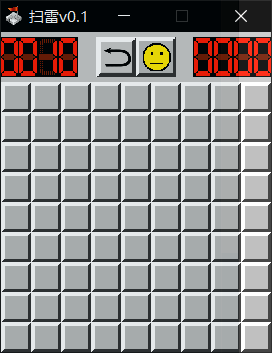
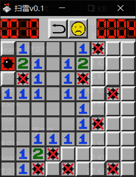
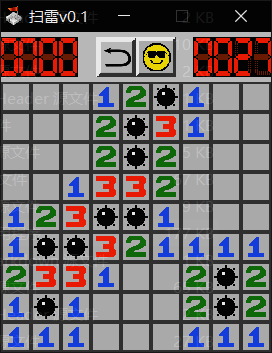
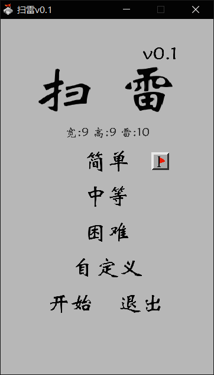

## 扫雷项目

使用 SDL2 写的扫雷游戏以及相关的菜单 UI,界面比较朴素，主要供学习参考使用。

### 界面

#### 游戏界面

  

#### 菜单界面

### TODO
 
- [x] 初始九宫格无雷  
- [x] 计时  
- [x] 记雷  
- [x] 判断成功与失败情况  
- [x] 重新开始  
- [x] 返回主菜单
- [ ] 更换图标
- [ ] 翻译与国际化
- [ ] 面板界面展示分数  
- [ ] Sqlite 储存本地用户数据
- [ ] 排名系统与历史成绩排行展示
- [ ] 基于贝叶斯概率分析的智能提示
- [ ] AI 按钮
- [ ] 代码重构

### PS

TODO 部分一个比一个麻烦, 有空做着玩玩吧.

C语言写 GUI ,指针满天飞,简直是按像素编程. 想试试前端写 GUI 。